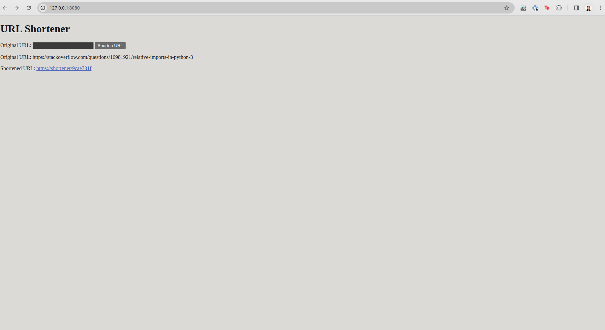

# URL Shortener - Overview

The goal of this project is to create a microservice system in Python that allows shortening URLs through a REST API, 
storing them in a database, and redirecting to the original addresses. The system uses task queues for asynchronous 
processing of URL shortening requests, ensuring high performance and scalability.

- **Asynchronous Task Handling -** 
The microservice is able to accept URL shortening tasks and process them asynchronously - Celery and Redis
- **REST API -** Implement a REST API that allows URL shortening, returning their shortened versions, and redirecting to original addresses - Flask
- **Containerization -** The application is containerized using Docker, with provided Dockerfile and docker-compose.yml for easy deployment
- **Data Storage -** Shortened URLs and their original versions should be stored in a database with a mechanism for checking duplicate URLs - alembic, mysql
- **User Interface -** Provided a simple user interface with a form for shortening URLs, displaying results and redirections
- **Testing -** Unit and integration tests to ensure the proper functioning of key system functionalities - pytest - **WiP**
- **API Documentation -** Utilize Swagger for documenting the REST API, facilitating user understanding and usage of the system - flasgger or flask-restx - **WiP**

## Installation and setup
1. Clone the repository to your local machine
2. Ensure that Docker and Docker Compose are installed on your system
3. Open a terminal in the project's root directory
4. Run the command ```docker-compose up --build``` to build and run the containers
5. Make migration - go to the main module in the docker `web` container and type commands from [here](#Migration-managment)
6. Once the application is running, it will be accessible at http://127.0.0.1:8080

Sample view after pasting the link into the form and clicking the "Shorten URL" button:


### Important!
Before using the application remember about migration inside the web container (see the next point)

## Migration managment

Use migrations to maintain your database schema:
```
alembic upgrade head
```

After each change in the structure of the ShortenedURL model, generate a new migration:
```
alembic revision --autogenerate -m "init"
```

## API Documentation - WiP
After launching the application, the API documentation will be available at http://localhost:8080/docs

## Testing - WiP
To run the tests, execute the command docker-compose run web python -m pytest.
Unit and integration tests will be automatically executed, and the results will be displayed in the terminal
